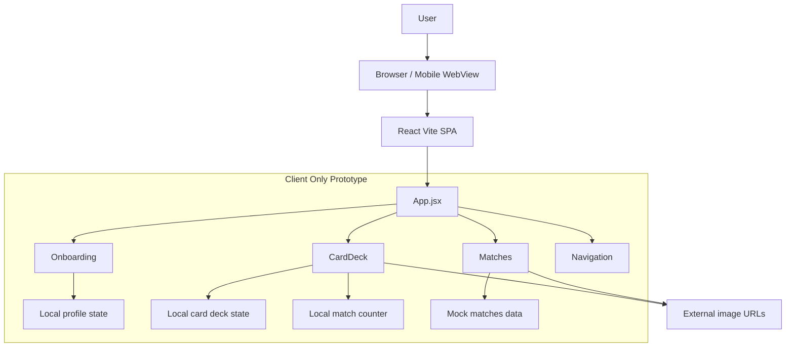
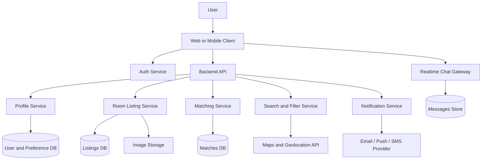
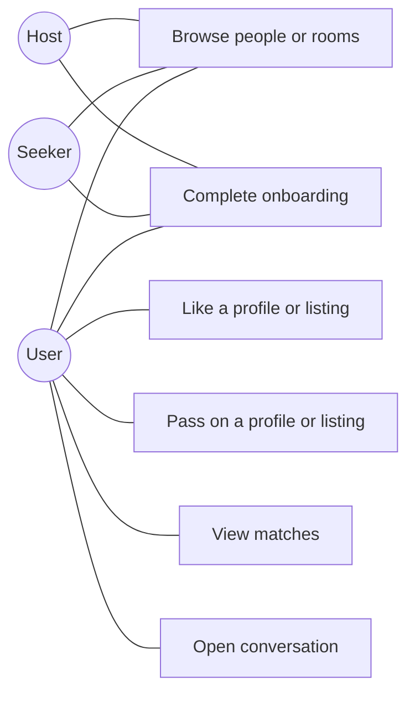
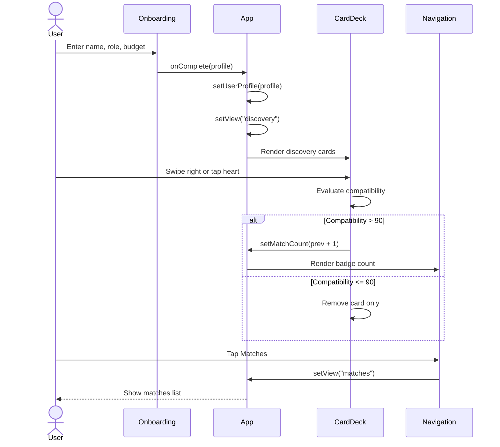
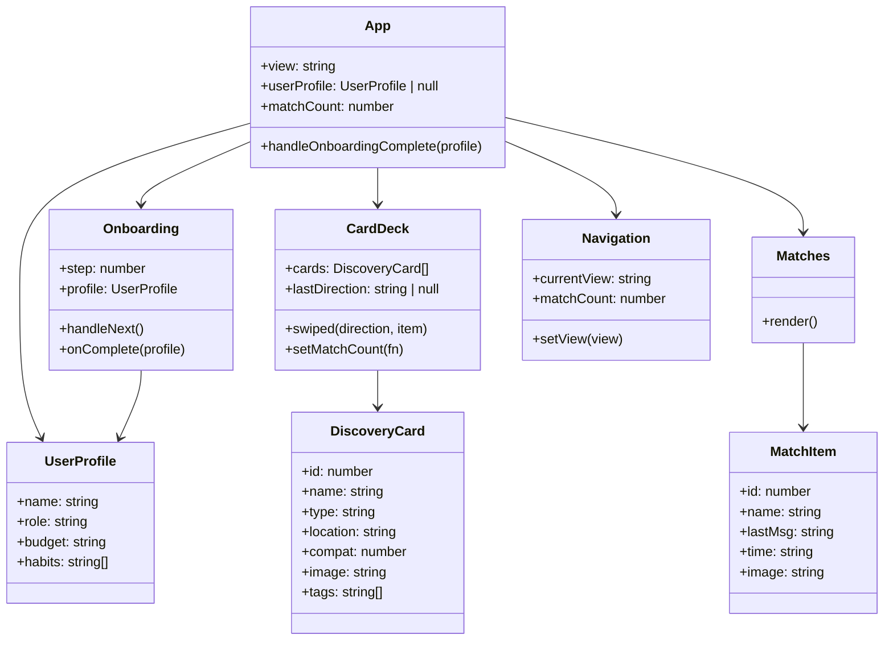

# Homie Diagrams

These diagrams are based on the current implementation in this repository and a recommended next-step production architecture for the same idea.

## Current App Snapshot

Homie is currently a client-side React/Vite prototype with:

- multi-step onboarding
- swipe-based discovery
- matches list
- bottom navigation
- local component state
- mock in-memory data
- remote image assets

There is currently no backend, database, authentication, messaging service, or matching engine implemented in the codebase.

## Current Architecture Diagram

## Recommended Target Architecture

## UML Use Case Diagram

## UML Sequence Diagram

## UML Class Diagram

## Notes

- `profile` is collected during onboarding, but the current app does not use it to personalize discovery or matches yet.
- discovery and matches both rely on hardcoded mock data arrays
- the navigation includes a `profile` view trigger, but there is no profile screen implemented in `App.jsx`
- swiping right increments the match count only when compatibility is greater than 90

## Good Next Diagrams To Add Later

- activity diagram for seeker onboarding to first match
- entity relationship diagram for users, listings, matches, and messages
- sequence diagram for real chat and room booking flow
- deployment diagram for frontend, backend, database, storage, and notifications
